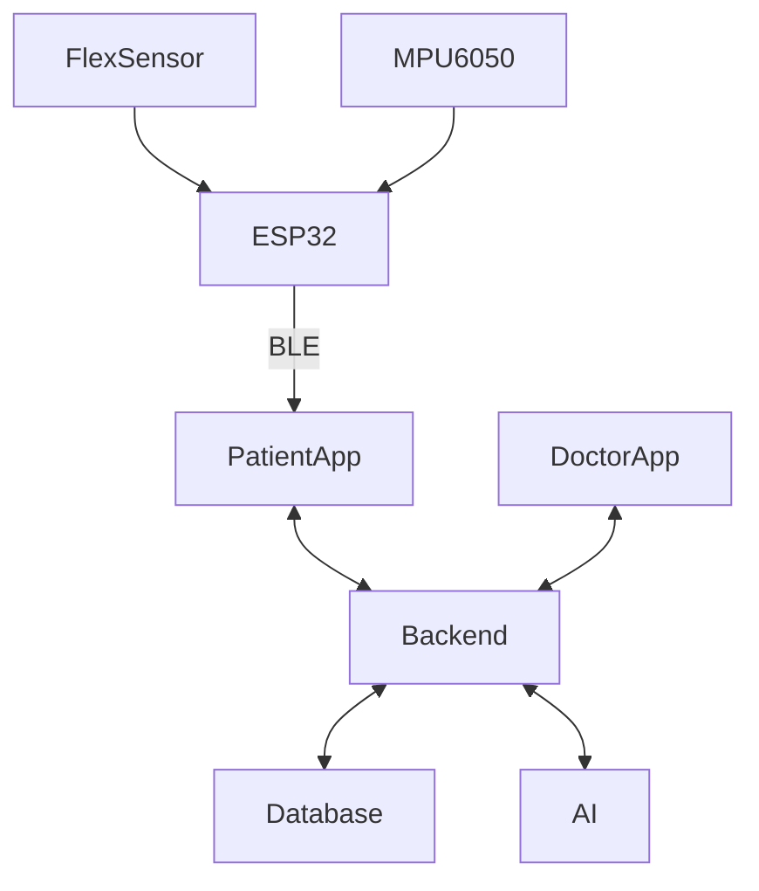

# The HapticSync — System Architecture


```
┌─────────────────────────────────────────────────────────────┐
│                       Hardware Layer                        │
│   ESP32 Glove: 3x Flex Sensors + 1x MPU6050 (6-axis IMU)    │
└──────────────────────────────┬──────────────────────────────┘
                               │ Bluetooth Low Energy (BLE)
                               ▼
┌─────────────────────────────────────────────────────────────┐
│                    Mobile / Client Layer                    │
│                        Flutter App                          │
│   - Real-time BLE sensor ingestion & calibration curves     │
│   - Gamified Rehabilitation (Piano, Pick and Place)         │
│   - Offline SQLite buffering & idempotent cloud sync        │
│   - Client-side token storage (Supabase Auth JWT)           │
└──────────────────────────────┬──────────────────────────────┘
                               │ HTTPS (FastAPI REST Endpoints)
                               ▼
┌─────────────────────────────────────────────────────────────┐
│                        Backend Layer                        │
│                     FastAPI Application                     │
│   - Supabase JWT Token Verification (HS256 local verify)    │
│   - Role-Based Access Control (Doctor vs. Patient)          │
│   - Business Logic Services (Onboarding, Sessions, Devices) │
│   - Idempotent Ingestion & Session Metric Aggregations      │
│   - PIN Lifecycle & Brute-Force Rate Limiting (bcrypt)      │
│   - Future AI Rehabilitation Analysis Pipelines             │
└──────────────────────────────┬──────────────────────────────┘
                               │ SQLAlchemy 2.0 (PostgreSQL Driver)
                               ▼
┌─────────────────────────────────────────────────────────────┐
│                         Data Layer                          │
│                   Supabase PostgreSQL DB                    │
│   - 15 relational tables with strict foreign keys & UUIDs   │
│   - Version-controlled migrations via Alembic               │
│   - Database-level constraints & index optimization         │
│   - Direct DB access restricted to FastAPI Backend ONLY     │
└─────────────────────────────────────────────────────────────┘
```

---

## 1. System Components & Separation of Concerns

### 1.1 Hardware Glove Layer
- **Microcontroller**: ESP32 with onboard Bluetooth Low Energy (BLE).
- **Sensors**:
  - **3 Flex Sensors**: Measure flexion angles of individual fingers (Thumb, Index, Middle).
  - **1 MPU6050 (6-axis IMU)**: 3-axis accelerometer + 3-axis gyroscope measuring wrist orientation, velocity, and tremor frequency.
- **Data Flow**: Streams raw ADC and IMU values via BLE notification packets directly to the mobile application at 20–50 Hz during active calibration and gameplay.

### 1.2 Flutter Mobile Client
- **Managed by Mobile Engineering Team**: Independent repository cadence.
- **Glove Connection**: BLE discovery, handshake, calibration, and streaming.
- **Games**:
  - *Piano*: Targets fine finger flexion timing and isolated finger movement.
  - *Pick and Place*: Targets wrist rotation, reaching trajectory, and grip coordination.
- **Network Resilience**:
  - Generates client-side UUID v4 identifiers for sessions and gameplay records.
  - Uploads completed therapy sessions, game scores, and sensor summaries to the FastAPI backend.
  - Automatically replays pending uploads on network restoration without creating duplicate server records.

### 1.3 FastAPI Backend
- **Security Perimeter**: Flutter **never** interacts directly with Supabase PostgreSQL tables. All reads, writes, and relationship queries route through FastAPI dependencies.
- **Stateless Authentication**: Verifies Supabase Auth JWT signatures locally via HMAC-SHA256 (`SUPABASE_JWT_SECRET`), avoiding redundant network hops per request.
- **Service Layer**: Decouples API route handlers from database ORM queries:
  - `patient_service.py`: Patient creation, PIN generation, roster queries.
  - `session_service.py`: Idempotent upserts for therapy sessions, game sessions, game results, and metrics.
  - `device_service.py`: Hardware registration and calibration curves.

### 1.4 Supabase PostgreSQL
- Relational storage for 15 core entities:
  - `profiles`, `doctors`, `patients`, `doctor_patients`, `patient_invitations`
  - `devices`, `patient_devices`, `device_calibrations`
  - `games`, `therapy_sessions`, `game_sessions`, `game_results`, `session_metrics`
  - `ai_analyses`, `clinical_reports`
- Managed via Alembic migrations.

---

## 2. Security & Authorization Model

```
                    ┌─────────────────────────┐
                    │      Supabase Auth      │
                    │   (User Identity & PW)  │
                    └────────────┬────────────┘
                                 │ JWT (sub = user_uuid)
                                 ▼
                    ┌─────────────────────────┐
                    │     FastAPI Backend     │
                    │   - verify_supabase_jwt │
                    │   - get_current_user    │
                    │   - check Doctor/Patient│
                    └────────────┬────────────┘
                   ┌─────────────┴─────────────┐
                   ▼                           ▼
        ┌─────────────────────┐     ┌─────────────────────┐
        │   Doctor Role       │     │   Patient Role      │
        │ - Onboard patients  │     │ - Upload own session│
        │ - View own roster   │     │ - Upload own metrics│
        │ - Read patient data │     │ - View own progress │
        │   (DoctorPatient FK)│     │   (patient_id check)│
        └─────────────────────┘     └─────────────────────┘
```

1. **Doctor Authentication**: Doctors sign up via email/password through Supabase Auth, receive an access token, and register their doctor profile via `POST /auth/register-doctor`.
2. **Patient Onboarding**:
   - Doctor creates a patient record via `POST /patients/onboard`.
   - The backend creates the Supabase Auth user via the Supabase Admin API and generates a cryptographically random 6-digit PIN.
   - The backend stores `bcrypt(PIN)` in `patient_invitations` with a 24-hour expiration.
   - The patient enters their email + PIN in Flutter. The backend verifies the hash, enforces a 5-attempt limit, marks the PIN as used, and returns a sign-in magic link.
3. **Data Boundary Enforcement**:
   - Doctors can only view patients with whom they have an `active` record in `doctor_patients`.
   - Patients can only upload or query sessions matching their own `patient_id` (derived from the validated JWT `sub`).

---

## 3. Data Flow & Offline Idempotency

```
Flutter Client                           FastAPI Backend                     PostgreSQL
      │                                         │                                 │
      │ 1. Complete Session (Generate UUID v4)  │                                 │
      │────────────────────────────────────────>│                                 │
      │    POST /therapy-sessions {id: UUID}    │                                 │
      │                                         │ 2. Check if UUID exists         │
      │                                         │────────────────────────────────>│
      │                                         │<────────────────────────────────│
      │                                         │    (Not found -> INSERT)        │
      │ 3. 201 Created                          │                                 │
      │<────────────────────────────────────────│                                 │
      │                                         │                                 │
      │ [Network Dropout / Retry with same UUID]│                                 │
      │────────────────────────────────────────>│                                 │
      │    POST /therapy-sessions {id: UUID}    │                                 │
      │                                         │ 4. Check if UUID exists         │
      │                                         │────────────────────────────────>│
      │                                         │<────────────────────────────────│
      │                                         │    (Found -> Return existing)   │
      │ 5. 200 OK                               │                                 │
      │    X-Idempotent-Replayed: true          │                                 │
      │<────────────────────────────────────────│                                 │
```

Every therapy session, game session, game result, and metric upload uses this pattern. Mobile network interruptions never result in partial writes or duplicated statistics.

---

## 4. Clinical Safety & Data Philosophy

- **Non-Diagnostic System Telemetry**: All metrics computed from sensor data (e.g. `flex_rom_mean`, `movement_velocity_max`, `smoothness_score`, `tremor_power`) are classified as **sensor-derived rehabilitation indicators**.
- The backend explicitly separates raw/computed session metrics (`session_metrics`) from human physician observations (`patients.notes` and `clinical_reports.notes`).
